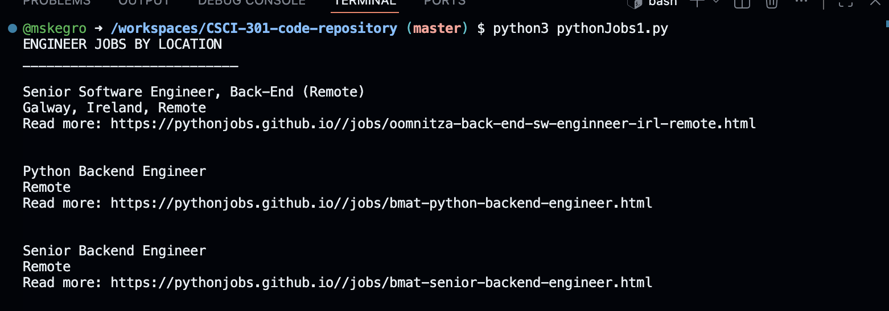
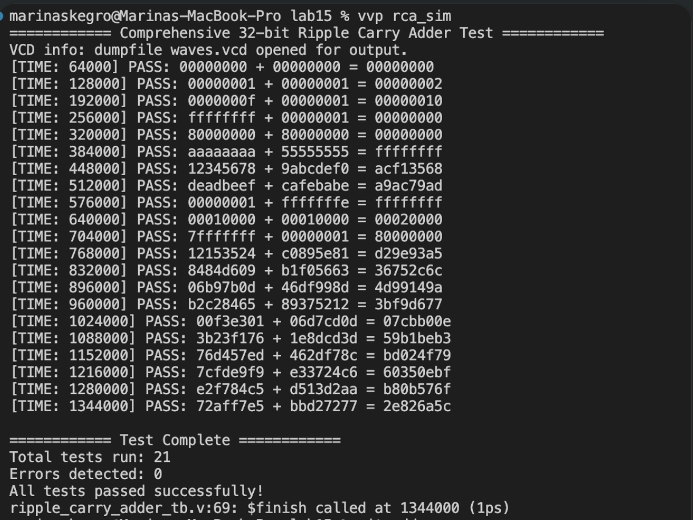
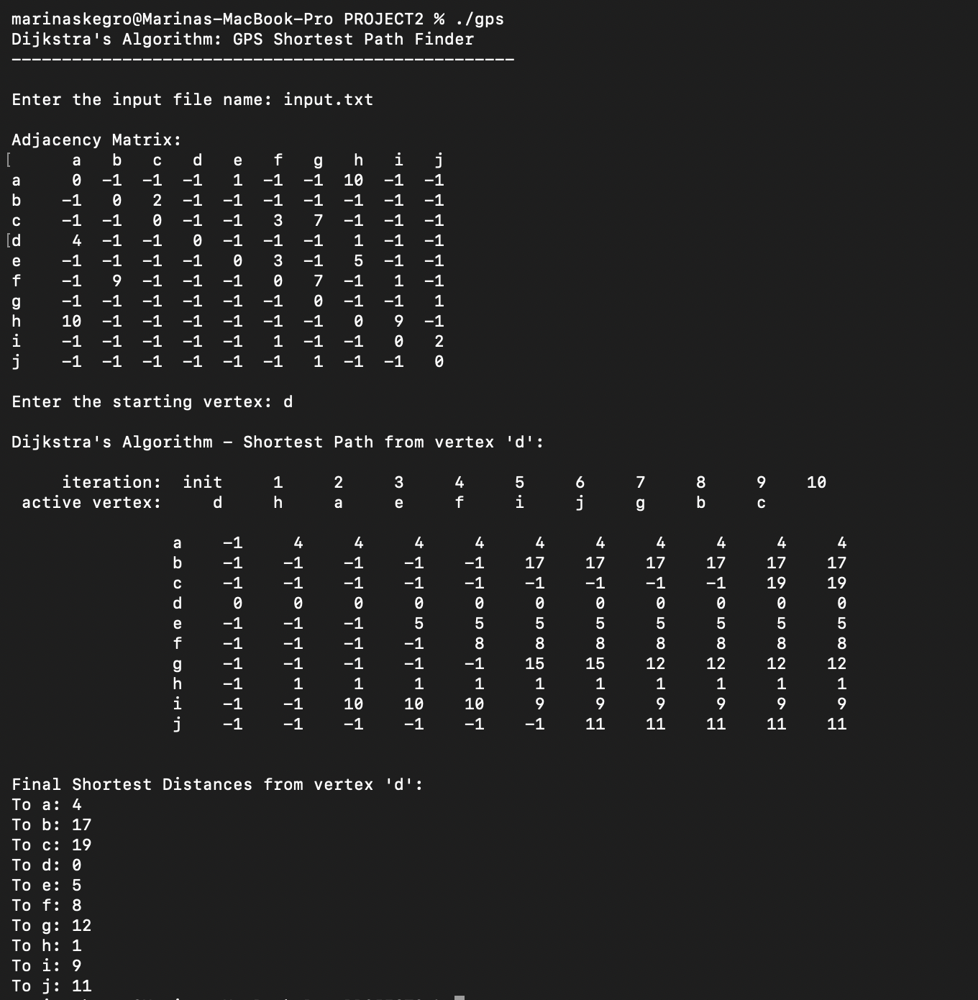

Portfolio
=========

Programming Projects
--------------------

*For access to my private project repositories, please [email me](mailto:mskegro@student.csuniv.edu?subject=GitHub%20Access) with the subject line, GitHub Access.

---
### [Python Job Web Scraper| CSCI 301](project1.md)

---
### [Graphs via Adjacency Lists | CSCI 315](project3.md)

---
### [Ripple Carry Adder | CSCI 330](project2.md)

---
### [Dijkstra's Algorithm GPS Shortest Path Finder | CSCI 415](project4.md)

---

### [Gamified Habit Tracker - Habit Love | CSCI 496](project5.md)

---

Ethics Papers
-------------

### [Ethics in Software Development](/pdf/paper1.pdf)

-   **Class: CSCI 315**  
-   **Grade: A**

### [A Double-Edged Sword in the Digital Age](/pdf/paper2.pdf)

-   **Class: CSCI 330** 
-   **Grade: A**

### [Ethics Paper](/pdf/paper3.pdf)

-   **Class: CSCI 415** 
-   **Grade: A**

---

Presentations
-------------

### [Leukemia Charity 5K Run](/pdf/sample_presentation.pdf)

- **Class: CSCI 334** 
- **Grade: A**

### [Paging in Oracle Spars Solaris](/pdf/presentation2.pdf)

- **Class: CSCI 431** 
- **Grade: A**

---

Page template forked from <a href="https://github.com/csu-cs/csci-portfolio">CSU-CS</a>

<!-- Remove above link if you don't want to attributive -->
