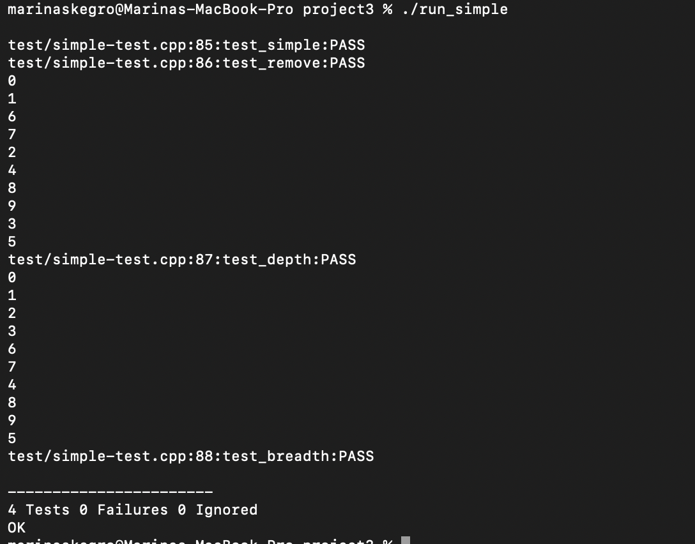
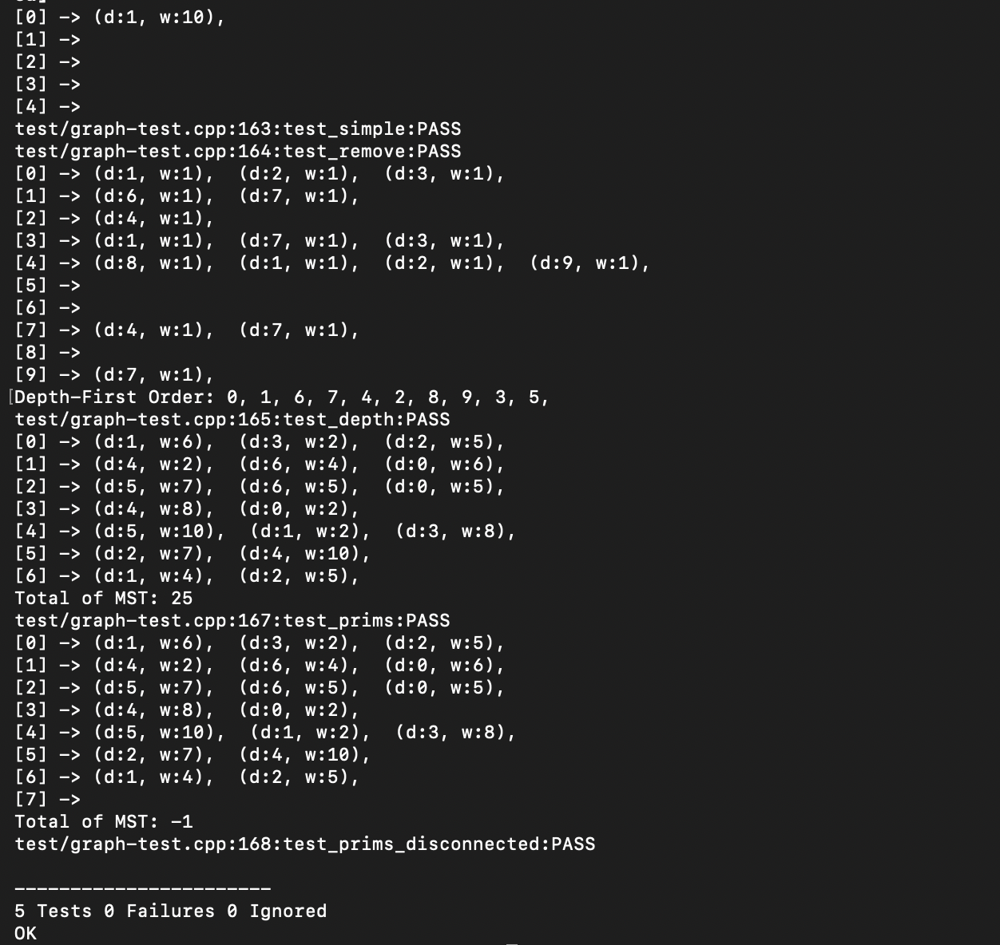

[Back to Portfolio](./)

# Graphs via Adjacency Lists

- **Class: Data Structures & Algorithms**
- **Grade: A**
- **Language(s): C++**
- **Source Code Repository:** [mskegro/csci-315](https://github.com/mskegro/csci-315)  
  (Please [email me](mailto:mskegro@student.csuniv.edu?subject=GitHub%20Access) to request access.)

## Project Description

This project implements a weighted directed graph using an adjacency list representation in C++. The graph is built as a generic template class `GraphAL<Weight>`, where vertices are indexed starting from 0 and edges carry associated weights.

The implementation supports full graph operations including adding and removing vertices and edges, depth-first and breadth-first traversals, and computing the minimum spanning tree weight using Prim's algorithm.

## How to Run the Program

To run this project, follow the steps below.

### 1. Clone the repository

```bash
git clone https://github.com/mskegro/csci-315
```

### 2. Navigate to the project folder

```bash
cd csci-315/project3
```

### 3. Compile the test files

Compile each test file separately as they each contain their own `main`:

```bash
g++ -std=c++20 -I src -DUNITY_EXCLUDE_FLOAT -o run_simple src/GraphAL.cpp test/simple-test.cpp test/unity.c
```

```bash
g++ -std=c++20 -I src -DUNITY_EXCLUDE_FLOAT -o run_graph src/GraphAL.cpp test/graph-test.cpp test/unity.c
```

### 4. Run the tests

```bash
./run_simple
./run_graph
```

### View Output

The program runs in the terminal and verifies:

- Correct graph construction via adjacency list
- Accurate depth-first and breadth-first traversals
- Proper edge and vertex addition and removal
- Correct minimum spanning tree weight using Prim's algorithm

## UI Design

This program runs in the terminal and does not include a graphical user interface. Output is displayed in the console via the `print()` method and Unity test results, confirming correct graph behavior.

The simple test suite verifies basic graph operations, including edge addition, adjacency checks, and edge removal (see Fig. 1).

  
Fig 1. Terminal output of simple test suite verifying basic graph operations

The full graph test suite verifies depth-first traversal, Prim's minimum spanning tree algorithm, and disconnected graph handling (see Fig. 2).

  
Fig 2. Terminal output of graph test suite verifying traversals and MST results

## 3. Additional Considerations

This project highlights important data structures and algorithms concepts such as:

- Adjacency list representation of weighted directed graphs
- Depth-first and breadth-first graph traversal algorithms
- Prim's algorithm for minimum spanning tree computation
- Dynamic memory management and Valgrind-verified leak-free code
- Unit testing with the Unity testing framework

For more details see [mskegro](https://github.com/mskegro/csci-315).

[Back to Portfolio](./)
