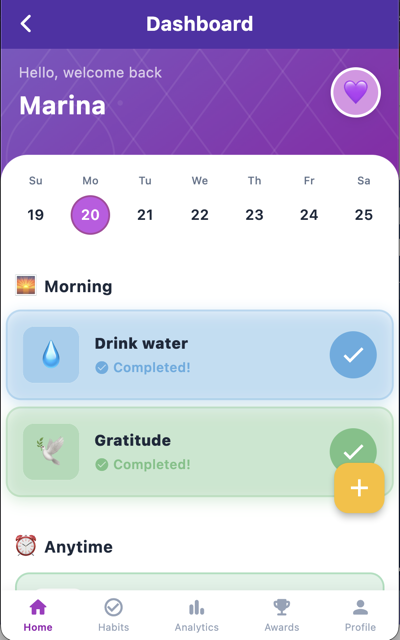

[Back to Portfolio](./)

# Gamified Habit Tracker

- **Class: Senior Project Implementation/Defense (CSCI 496)**
- **Grade: In Progress**
- **Language(s): Dart**
- **Source Code Repository:** [mskegro/habit_tracker](https://github.com/mskegro/habit_tracker)  
  (Please [email me](mailto:mskegro@student.csuniv.edu?subject=GitHub%20Access) to request access.)

## Project Description

Habit Love is a gamified habit-tracking app built with Flutter and Firebase. The app transforms the often dull process of building new habits into an engaging, rewarding experience where users earn XP for completing daily habits, level up as they grow, and unlock achievement badges for hitting milestones. Streaks keep users accountable day over day, while a built-in analytics dashboard visualizes progress through weekly and monthly charts so users can actually see themselves improving over time. All data syncs to the cloud in real time via Firebase, meaning progress is never lost and is accessible across devices. The result is an app designed to make habit formation more engaging and sustainable.

## How to Run the Program

To run this project, follow the steps below.

### 1. Clone the repository
```bash
git clone https://github.com/mskegro/habit_tracker
```
### 2. Navigate to the project folder
```bash
cd habit_tracker
```
### 3. Install dependencies
```bash
flutter pub get
```
### 4. Run the program
```bash
flutter run 
```
### 5. View output
The app will launch, and from there you can:
- Create an account or log in with your email
- Create and customize habits
- Complete habits to earn XP and build streaks
- View your achievements and analytics dashboard

## UI Design

The main dashboard displays today's habits as interactive cards, along with the user's current XP, level, and streak counts (see Fig. 1).

  
Fig 1. The home dashboard

The habit creation screen allows users to name a habit, assign a color, and set a recurrence schedule (see Fig. 2).

  
Fig 2. The habit creation screen

The achievements screen displays all unlocked and locked badges, with locked badges shown in grayscale alongside their unlock criteria (see Fig. 3).

  
Fig 3. The achievements screen

The analytics screen uses fl_chart to render weekly bar charts and monthly progress trends pulled from Firestore (see Fig. 4).

  
Fig 4. The analytics dashboard

## Additional Considerations

This project highlights important software engineering concepts such as:

- Gamification mechanics including XP, streaks, levels, and achievement badges
- Real-time cloud sync using Firebase Firestore and Firebase Authentication
- State management using the Provider pattern in Flutter
- Data visualization using fl_chart for analytics and progress tracking

For more details see [mskegro/habit_tracker](https://github.com/mskegro/habit_tracker).

[Back to Portfolio](./)
